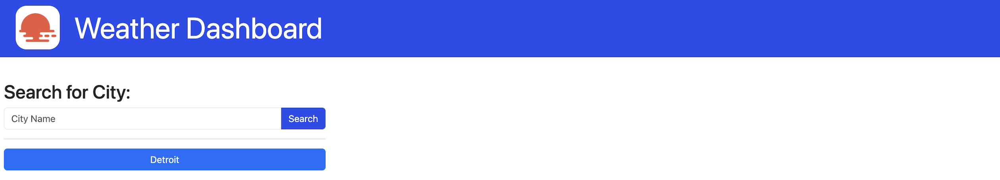

## Weather Dashboard

[Weather Dashboard](https://theoarsman.github.io/Weather_Dashboard_SS_API/) 

## Description

Developers, ever tasked with integrating third-party APIs, can now effortlessly access weather data for cities with this browser-based weather dashboard. Leveraging the [5 Day Weather Forecast](https://openweathermap.org/forecast5), this dashboard dynamically updates HTML and CSS, providing users with accurate and up-to-date weather information.

Utilizing localStorage, the dashboard ensures persistent data storage, maintaining user preferences and settings across sessions.

## Table of Contents

- [Weather Dashboard](#weather-dashboard) 
- [Description](#description) 
- [Table of Contents](#tabel-of-contents) 
- [User Story](#user-story) 
- [Acceptance Criteria](#acceptance-criteria) 
- [Installation](#instllation) 
- [Development](#development) 
- [Usage](#usage) 
- [Technologies](Technologies)
- [License](#license) 
- [Contributing](#contributing) 
- [Tests](#tests) 
- [Resources](#resources) 
- [Questions/Contact](#questionscontact)

## User Story

**AS A** traveler  

**I WANT** to see the weather outlook for multiple cities  

**SO THAT** I can plan a trip accordingly

## Acceptance Criteria

**GIVEN** a weather dashboard with form inputs

**WHEN** I search for a city  
**THEN** I am presented with current and future conditions for that city and that city is added to the search history

**WHEN** I view current weather conditions for that city  
**THEN** I am presented with the city name, the date, an icon representation of weather conditions, the temperature, the humidity, and the wind speed

**WHEN** I view future weather conditions for that city  
**THEN** I am presented with a 5-day forecast that displays the date, an icon representation of weather conditions, the temperature, the wind speed, and the humidity

**WHEN** I click on a city in the search history  
**THEN** I am again presented with current and future conditions for that city

## Installation

No installation needed. See link at top or below in Usage.

## Development

In the future, I intend to enhance the weather display by customizing the cards. Utilizing the icon codes provided by the 5 Day Weather Forecast, I will assign specific GIFs to serve as background images for each card.

Although I successfully deployed the feature, I encountered styling challenges in containing the GIFs within the cards themselves. You can find the relevant code in my script.js file, currently commented out. I aim to uncomment this code once I've resolved the styling issues.

## Usage

[Weather Dashboard](https://theoarsman.github.io/Weather_Dashboard_SS_API/)

## Technologies

## License

PLACEHOLDER UNTIL WE DECIDE WHICH LICENSE TO WE WANT TO USE

MIT License

Copyright 2024 Heinz Ulrich V

Permission is hereby granted, free of charge, to any person obtaining a copy
of this software and associated documentation files (the "Software"), to deal
in the Software without restriction, including without limitation the rights
to use, copy, modify, merge, publish, distribute, sublicense, and/or sell
copies of the Software, and to permit persons to whom the Software is
furnished to do so, subject to the following conditions:

The above copyright notice and this permission notice shall be included in all
copies or substantial portions of the Software.

THE SOFTWARE IS PROVIDED "AS IS", WITHOUT WARRANTY OF ANY KIND, EXPRESS OR
IMPLIED, INCLUDING BUT NOT LIMITED TO THE WARRANTIES OF MERCHANTABILITY,
FITNESS FOR A PARTICULAR PURPOSE AND NONINFRINGEMENT. IN NO EVENT SHALL THE
AUTHORS OR COPYRIGHT HOLDERS BE LIABLE FOR ANY CLAIM, DAMAGES OR OTHER
LIABILITY, WHETHER IN AN ACTION OF CONTRACT, TORT OR OTHERWISE, ARISING FROM,
OUT OF OR IN CONNECTION WITH THE SOFTWARE OR THE USE OR OTHER DEALINGS IN THE
SOFTWARE.

## Contributing

N/A

## Tests

None currently

## Resources

[5 Day Weather Forecast](https://openweathermap.org/forecast5)

## Questions/Contact

**Developer:** Heinz Ulrich V

 

 

 

